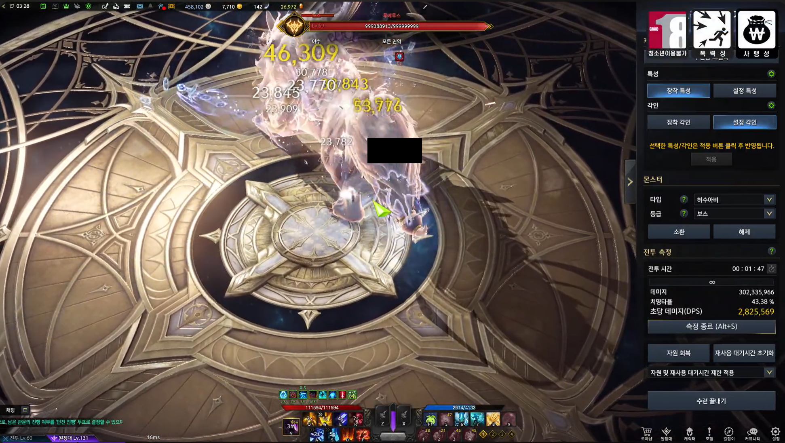

로스트아크 시뮬레이터 repo에 첫 커밋을 한지 약 1년 5개월이 지났다.

어떻게 보면 진짜 필요한 서비스를 만들면서, 웹 개발에 대해서 아무것도 모른채 무작정 박아보려는 시도였기 때문에 좀 오래 지연된것 같다.

회고를 하면서 휘발될 수도 있었던 귀중한 경험을 빠뜨리지 않도록 해보자.

# 기획 의도

예전에 나는 아르카나라는 클래스를 주력으로 키웠다.

아르카나라는 직업에 대해서 설명해보자면,

1. 아이덴디티인 '카드'가 랜덤으로 뽑힌다.
2. 이 '카드'에 따라서 딜 사이클을 유연하게 변경해야 했다.
3. 따라서 딜 편차가 꽤 심한 편이었고, 카드가 뽑힌 즉시 상황판단을 해야해서 초보와 고수의 격차가 극심했다.

이런 문제 때문에 아르카나 게시판에서는, 딜 사이클을 점검할 때 단순히 한 사이클 돌려보는 다른 직업과 다르게 5분/10분, 심하게는 1시간 정도 루메루스(허수아비)를 쳐야지 내 기대 dps를 알 수 있었다.

정리하자면
- 내가 딜 사이클을 잘 굴리고 있는지 알기도 힘들고, 
- 내 기대 dps가 얼마나 되는지 알기 힘들었다.

그리고 한창 기획을 하게 될 때는, 단순 장비레벨과 무기 강화수치로 얼추 캐릭터의 강함을 알 수 있는 시대를 넘어 엘릭서와 초월이라는 색다른 스펙업 수단이 생겨서, 이제 레벨만 보고서는 내가, 그리고 지원자가 얼마나 셀지 알 수 없었다.

더 나아가 커뮤니티에서 밸런스 토론을 할 때, "무슨무슨 직업이 지금 세다더라~" 하는 경험담으로만 구전되는데,이는 각 캐릭터의 스펙 상태에 따라, 그리고 경쟁 상대의 스펙 상대에 따라, 그리고 서폿 버프차이에 따라 체감하는게 너무 다를 수 밖에 없어서 명확한 지표를 삼을 수 있는 무언가가 있었으면 좋겠다고 생각했다.

그래서 내 캐릭터와 샘플 캐릭터의 예상 DPS를 도출해내는 시뮬레이터가 있으면 좋겠다고 생각했다.

# 유사 서비스 조사

특히 AI로 서비스를 만들기 쉬워진 요즘, 경쟁 서비스나 한국 게임의 다른 서비스가 어떠한 방식을 채용했는지 생각해봤다.

생각해본것은 던전앤파이터의 '던X'과, 메이플스토리의 '환X주스탯'이었는데,

'던X'는 특정 시간 내에 해당 스킬을 몇번 사용할 수 있는지 계산해서 스킬 데미지x사용 횟수를 모두 합산해서 계산하게 된다.
던전앤파이터라는 게임 특성상, 스킬 간 연계가 적어서 스킬의 쿨타임이 돌아오는 대로 사용하기 때문에 합리적이다.

하지만 로스트아크의 경우에는, 스킬간 연계가 매우 강하고, 랜덤 요소가 많아서 맞지 않는 방법이다. 아르카나라는 직업 뿐만 아니라, '예리한 둔기'와 같이 확률적으로 데미지가 감소하는 각인을 대중적으로 많은 캐릭터가 사용한다. 제일 중요한 부분은, 던전앤파이터는 모든 직업이 100%의 크리티컬 확률을 맞추는 것을 기본으로 한다. 로스트아크는 치명타 확률이 모두 다르기 때문에 이에 따른 편차가 분명히 존재하게 되므로 기댓값과 편차가 더욱 커진다고 생각했다.

'환X주스탯'은 각 직업마다 딜 사이클을 잘 소화하는 사람의 딜 지분(전체 데미지에서 각 스킬의 지분이 얼마나 되는지)을 수집해서 사용자의 캐릭터가 딜을 해도 대표 딜 지분과 유사하게 나올것으로 가정하고 DPS가 얼마나 나올지 예측하는 방식을 사용한다.

이 또한 로스트아크는 연계 스킬이 많은 만큼, 단순 딜지분만으로 해당 캐릭터의 DPS를 예측하기 힘들다. 또한 로스트아크는 보석 차이에 따라서 스킬의 쿨타임이 크게 변하기 때문에 치명적이다. 예를들어 특정 직업의 고점 빌드는 스킬 하나가 밀리면 모든 스킬이 사용 불가능한 경우가 발생하는 경우가 발생한다.

위와 같은 방법은 결과적으로 사용자 커뮤니티에서 정형화된 데이터를 개인화 작업에 바로 적용할 수 있어서 비교적 쉽게 사용자 캐릭터의 유효한 지표를 산출할 수 있었지만, 로스트아크라는 게임에서는 불가능하다고 생각했다.

따라서 월드오브워크래프트의 'Simulationcraft'가 사용하는 몬테카를로 통계를 내는 방식이 제일 적합한 방식이라고 생각했다. 몬테카를로 방식은 진짜 시뮬레이터로 n번 돌려서 통계를 내는 방식이다. 무식하다면 무식하지만 직관적으로 결손치없는 통계를 뽑을 수 있는 장점이 있다.

# 초기 기술 Stack 선정

처음에 전체적인 아키텍처와 기술스택을 선정할 때, Raidbot 서비스를 참고했다. 참고로 Simulationcraft는 포터블한 시뮬레이터 자체를 의미하고, 웹에서 서버가 이 SimC를 돌리게 해주는 서비스가 Raidbot이다. 

필요한 기능을 생각해보자면

1. 전투정보실 처럼 내 캐릭터를 볼 수 있는 기능
2. 시뮬레이션을 하기 위해서 내 캐릭터를 커스터마이징할 수 있는 기능
3. 실제 서버에서 시뮬레이션을 돌리고 결과를 보는 기능

여기서 전투정보실 기능과 시뮬레이션 기능이 동일한 게임데이터를 참조하기 때문에, docker를 공부하면서 컨테이너를 설계했다.
1. 시뮬레이션 컨테이너
2. 프론트엔드 컨테이너
3. 게임 데이터 컨테이너
4. FE에서 DB 컨테이너랑, 시뮬레이터 컨테이너를 단일 진입점으로 관리하기 위한 api-gateway 컨테이너

api-gateway 컨테이너는 지금와서 생각해보면 오버엔지니어링이었다. MSA가 한창 대세일때라서 MSA와 api-gateway 개념을 잡고가고 싶은 욕심이었던것 같다. 그리고 api-gateway도 직접 만드는게 아니라, 잘 만들어진 자동화된 라이브러리를 사용하는게 맞았다. be에서 api endpoint를 하나 수정하면 api-gateway도 수정해야하니 일을 두번해야 했다. 잘 모르는 상태에서는 필요에 의해서 기술 레이어를 추가하는게 옳다는 것을 배웠다.

물론 해당 프로젝트가 '실제 프로젝트를 만드는것'과 '웹 서비스를 처음 만들어보기' 그 중간에 해당해서 생긴 병목이었지만.