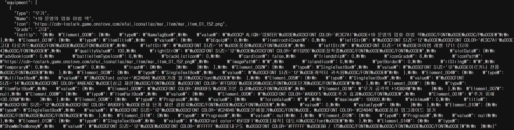

일단 캐릭터의 시뮬레이션을 돌리기 위해서는, 캐릭터 정보를 게임사에서 받아올 필요가 있었다.

어?

# 파서랑 놀기

대충 읽어보니, 프론트에서 넘겨준 코드 그-대로 띄우면 되도록 주고있었다.

왜 api 서비스가 프론트가 해야할 일을 대신해서 데이터를 활용하는 개발자들이 왜 2차 파싱을 해야하는지는 모르겠다...

심지어 `element-001` 와 같은 형태라서 이름으로 구분할 수 있는 것도 아니고, 각 요소마다 파싱을 일일히 따서 했어야 했다.

기술적인 뭔가가 있는건 아니고 단순 노가다라서 여기서 시간이 오래 걸렸다. 다시 한번 모듈의 책임을 명확히 해야할 필요성과 api 서버를 짠다면, 데이터를 활용하는 개발자가 어떨지 생각해봐야 하지 않을까 다시 생각해보는 계기가 되었다.

# CRA -> Vite

나는 특히나 프론트개발을 할 일이 별로 없었기 때문에 예전에 인터넷강의에서 들었던 CRA - CreateReactApp을 사용해서 React 페이지를 짜고 있었는데, 서버에서 프론트엔드 빌드가 너무너무 오래걸려서 이상하다는 생각이 들었다. 그렇게 복잡한 사이트도 아닌데 5~10분이상 걸린다는게 말이 안된다고 생각했다.

구글링과 AI와 면담을 좀 하다보니 요즘은 Vite라는 대체재를 주로 사용한다고 했다. Vite로 migration하니 build속도가 약 1/10 수준으로 줄어서 놀랐다.

CRA와 Vite는 **Build Tool**인데, 이름이 tool인것처럼 다양한 일을 한다. 사용자가 요청한 웹페이지를 조금이라도 빠르게 받기 위해서는, 그 웹페이지의 코드가 짧고 효율적이어야 한다. 그리고 server에 가하는 부하도 줄어든다.

그래서 build tool은 다음과 같은 작업을 한다:

1. import하고 안쓰는 module/export하고 안쓰는 function 정리
2. 실제 동작에 필요없는 괄호 제거 (괄호를 안써도 어짜피 우선도가 높은 경우라던가)
3. 개발자가 활용하기 용이하도록 길게 작성된 변수명/함수명을 짧게 축약
4. typescript로 작성된 코드를 javascript으로 변환 (ts으로 작성해도 실제로 돌아가는건 js다)
5. 여러 파일로 이루어진 코드들을 하나로 만들어서 보냄 (Bundling)

예전에 번들러에 대해서 공부했을때는 ~파일이 여러개면 각각 네트워크 비용이 들어서 비효율적이다~ 이렇게 이해했는데 생각해보니 병렬로 보내면 크게 문제되지는 않다는걸 알게 되었다.

TCP 연결이 제한되어있었던 구시대의 장점이지만, 여전히 코드를 효율화할 때 번들링을 하게 되면 중복된 부분을 크게 줄일 수 있는 장점이 남아있다.

빌드 자체가 빨라지는 이유는 CRA은 webpack을 쓰고, Vite는 esbuild+rollup을 사용하기 때문이다. webpack은 js기반이고, esbuild는 go기반이라 근본적인 속도차이가 크게 난다. 애초에 esbuild가 webpack의 느린 속도 문제 때문에 개발되었다.

Vite는 dev 레벨에서는 esbuild만을 사용해서 빌드속도가 매우 빠르고, prod 레벨에서는 안정성을 위해서 rollup을 사용하는데, esbuild로 의존성 번들링을 전처리 하고 rollup으로 최종 번들링을 하기 때문에 stable하지만 그래도 비교적 빠르게 빌드를 할 수 있게 된다.

이제 CRA는 2022년이후로 update가 없는 depreciated 상태이므로 사용되는것이 권장되지 않는데, 이를 인지하지 못했던것 같다.

이런 build tool의 성능 차이에 대한 원인이 언어에 있었던 만큼, 추후 시뮬레이터 언어 선정에 대해서 무의식적으로 영향을 끼친것 아닌가 싶었다.
